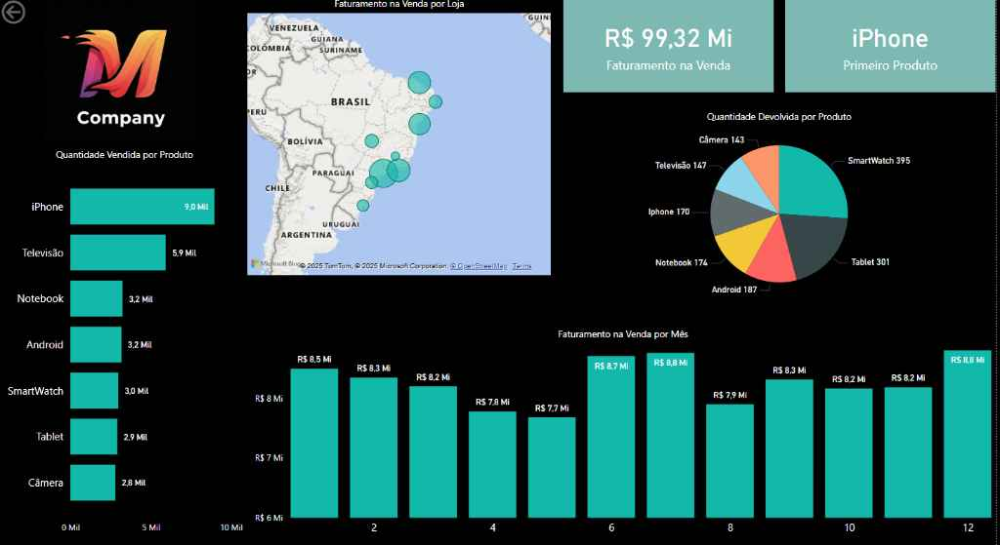

# powerbi-sales-dashboard
# Sales Dashboard – Power BI

This repository features an interactive dashboard created with Power BI to analyze sales performance by product, region, and monthly trends.

## Technologies Used
- Power BI Desktop
- Data source: simulated dataset containing information on sales, returns, and monthly revenue

## Dashboard Overview

## Key Metrics
- **Total Revenue:** R$ 99.32 million
- **Top-Selling Product:** iPhone (9.0K units)
- **Most Returned Products:** SmartWatch and Tablet
- **Sales Distribution by Region:** shown on the map
- **Monthly Revenue:** analysis of performance across all 12 months

## Repository Files
- `dashboard.pbix`: editable Power BI file
- `powebi-sales-dashboard.jpg`: image preview of the dashboard

## How to View the Dashboard
1. Download [Power BI Desktop](https://powerbi.microsoft.com/)
2. Download the `.pbix` file from this repository (when available)
3. Open the file in Power BI to explore the interactive dashboard

---
 Project by Mirella Fernandes
